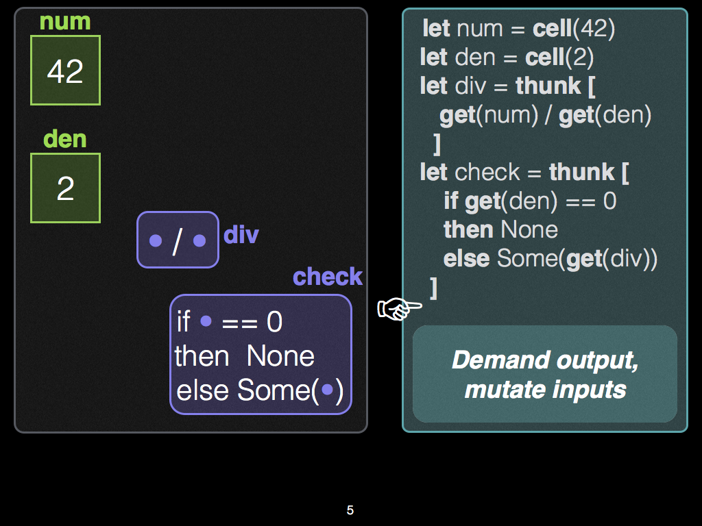
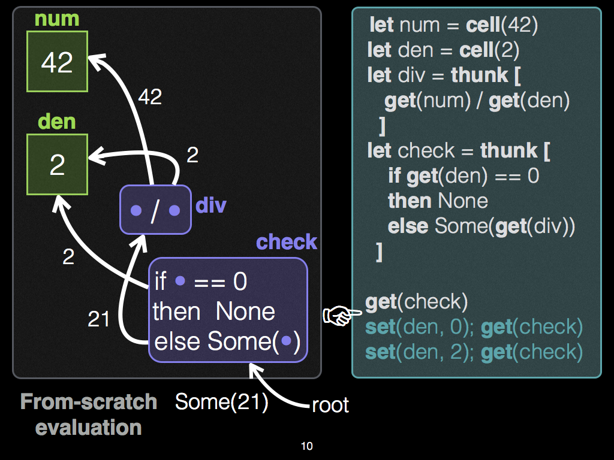
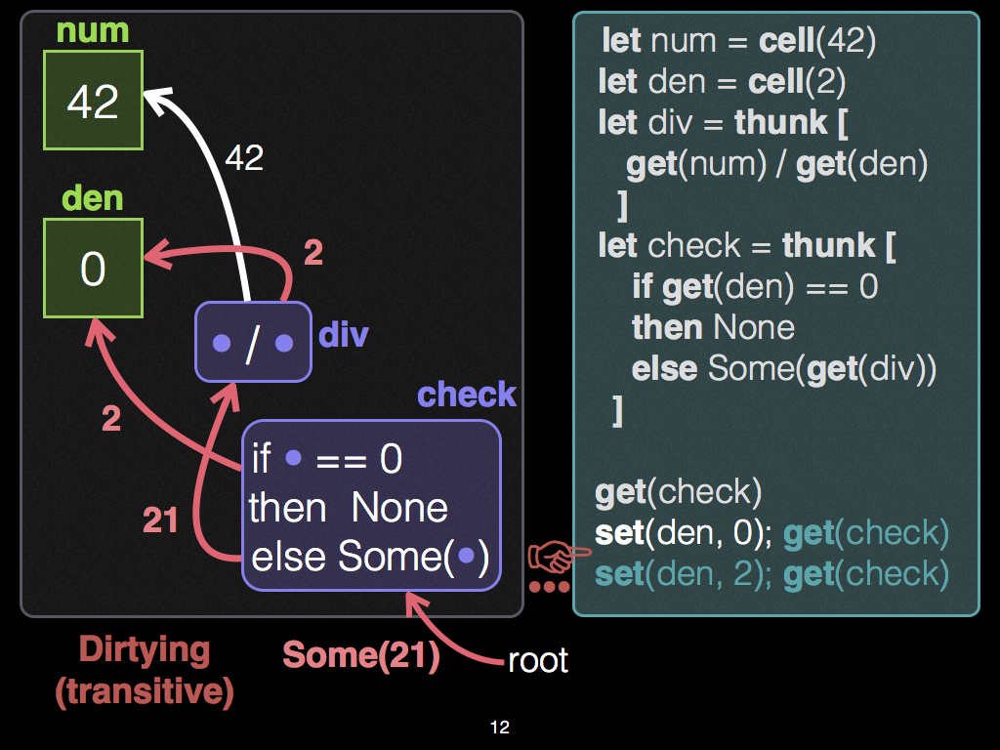
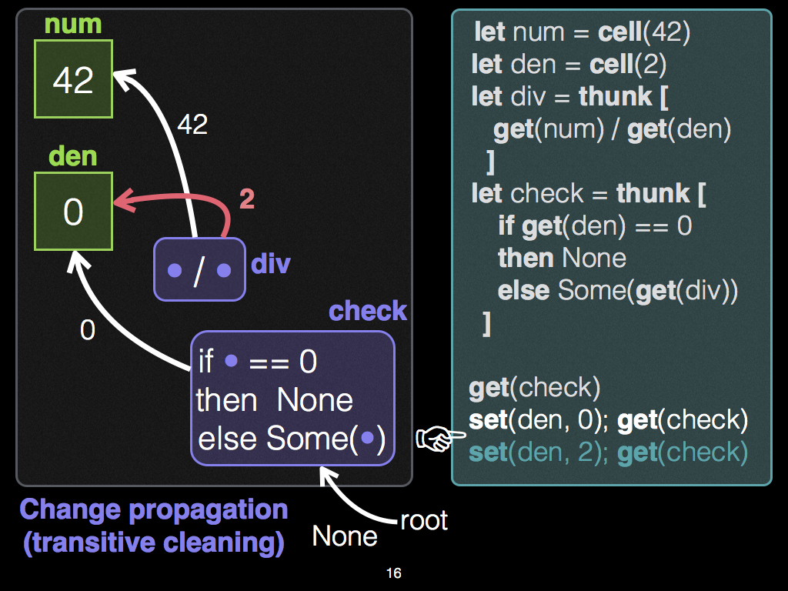
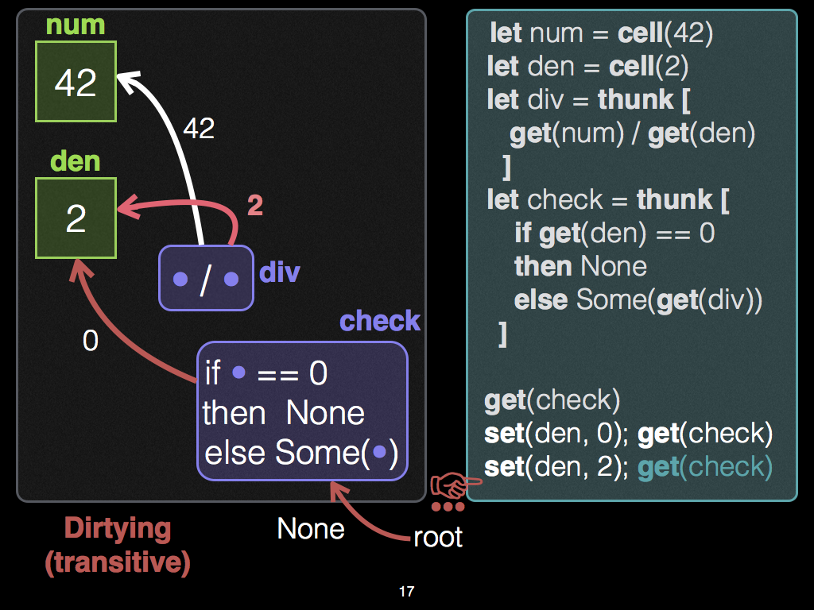
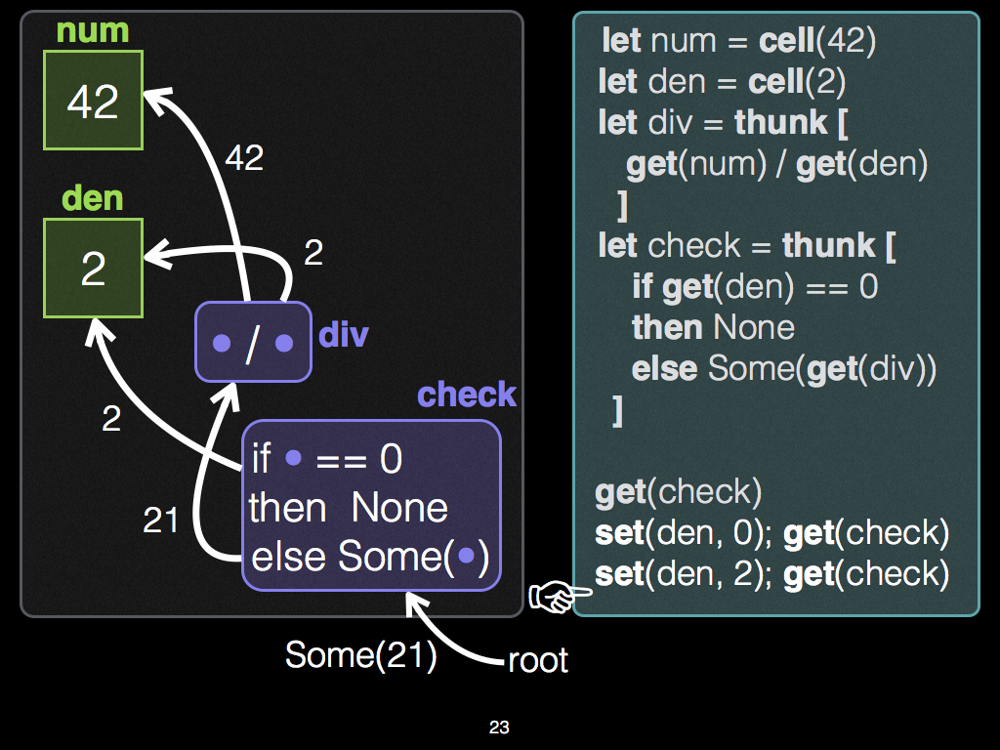

Adapton Example: Divide-by-Zero 
==================================
- Illustrates **demand-driven change propagation**.
- See also: [Example Rust code](https://docs.rs/adapton/0/adapton/macros/index.html#demand-driven-change-propagation)

Initial Graph, before initial demand
----------------------------------------------

Initial Graph, before initial demand (due to 1st `get`)
------------------------------------------------------

Initial Graph, after first dirtying phase (due to 1st `set`)
---------------------------------------------------------

Updated Graph, after first cleaning phase (due to 2nd `get`)
---------------------------------------------------------

Dirtied graph, after second dirtying phase (due to 2nd `set`)
---------------------------------------------------------

Updated graph, after second cleaning phase (due to 3rd `get`)
---------------------------------------------------------

As a movie:
-------------

